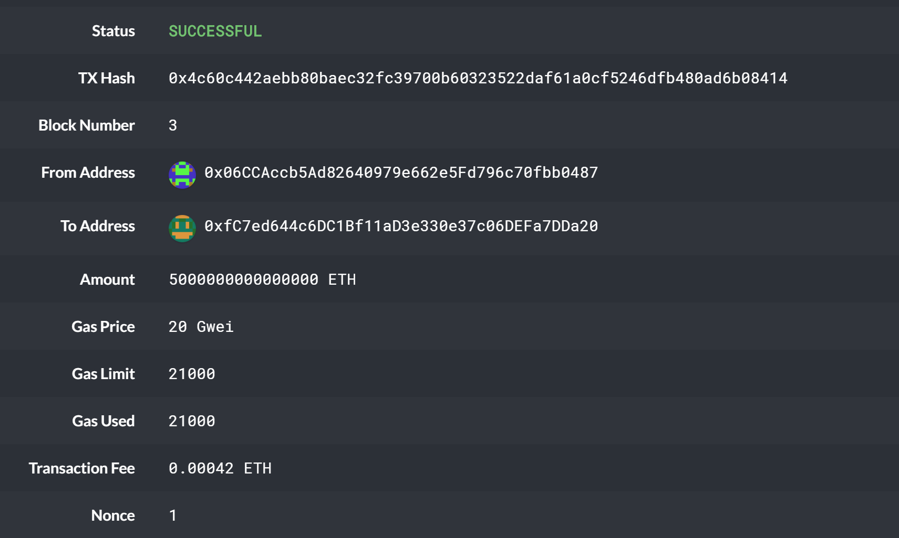
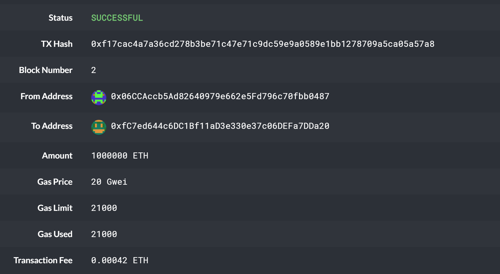
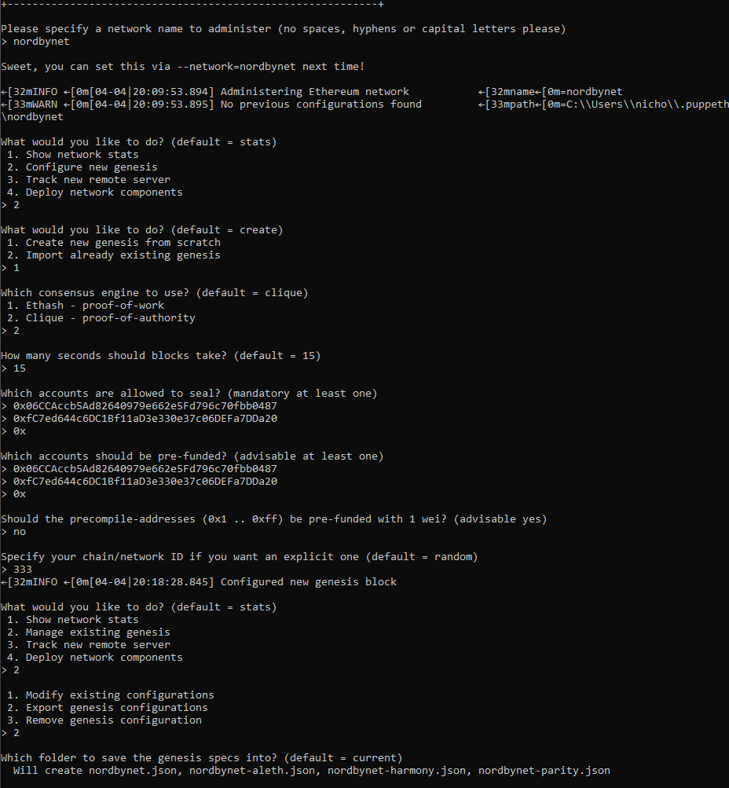
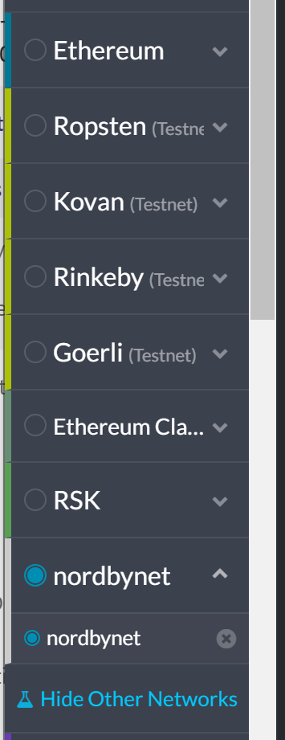

# homework_blockchain_poa

Nick Nordby

Blockchain Homework

Images folder contains screenshots - select screenshots below

Node folders contain my node information 

**Environment setup:**

> Download MyCrypto

> Download Geth & Tools 1.9.7 (windows 64 bit)
 
> Git Bash terminal set up for windows

**Network Setup:**

I was able to setup a network ("nordbynet") by closely following the PoA Guide. In the guide we used the geth tools in a terminal sesssion to determine the different parameters for the network and eventually launch the network. A screenshot of the setup is lower in this readme file, along with an outline of the configuration.

**Node Setup:**

With this homework assignment we set up two nodes on our network. To do this I first cd'd into the Blockchail-Tools folder on my computer, then in two separate terminal sessions (one for each node)...

*Node 1*

Established Node 1 through: ./geth --datadir node1 account new

Node 1 public address: 0x06CCAccb5Ad82640979e662e5Fd796c70fbb0487

Node 1 initialization: ./geth --datadir node1 init nordbynet.json

Initiate Node 1 mining: ./geth --datadir node1 --unlock "0x06CCAccb5Ad82640979e662e5Fd796c70fbb0487" --mine --rpc --allow-insecure-unlock

> The above code allows Node 1 to begin mining it by unlocking it, setting the "mine" directive, and instantiating it as the RPC node

*Node 2*

Established Node 2 through: ./geth --datadir node2 account new

Node 2 public address: 0xfC7ed644c6DC1Bf11aD3e330e37c06DEFa7DDa20

Node 2 initialization: ./geth --datadir node2 init nordbynet.json

Initiate Node 2 mining: ./geth --datadir node2 --unlock "0xfC7ed644c6DC1Bf11aD3e330e37c06DEFa7DDa20" --mine --port 30304 --bootnodes "enode://04d7acfc7c1067ee5afa04634cf804d779b6b03e2760a516a9490b1ad42f9344857bfd52a99695e7f7ae2fac74ca826b3d43001ef0b5345baeb97b4dced91807@127.0.0.1:30303" --ipcdisable --allow-insecure-unlock

> The above code allows Node 2 to begin mining by unlocking it & setting the "mine" directive, but in this case we set the "enode" address (copy and pased from Node 1) to allow Node 2 to communicate with Node 1

*Network*

Established network through: ./puppeth

> For the network we selected Proof of Authority, which delegates certain nodes (the ones created above) as administrators ("sealers"). We also prefunded the nodes in the setup process as well. 

**Network Configuration:**

Name: nordbynet

Blocktime: 15 seconds, per default

Chain ID: 333, the same as the homework

Password: None, I clicked enter twice to bypass the password requirement

Protocol: Ethereum

**Connecting to MyCrypto:**

To connect my network to MyCrypto, I followed the instructions highlighted in the "Running a Proof of Authority Blockchain", as follows:

> Click "Add Custom Node"

> Select "Custom" network

> Network name "nordbynet"

> Currency "ETH"

> Chain ID "333"

> HTTP: http://127.0.0.1:8545

**Screenshots**

Successful Transaction #1

Successful Transaction #2

nordbynet setup in terminal

nordbynet in mycrypto

Screenshots of node setup and initialization in the "Images" folder

